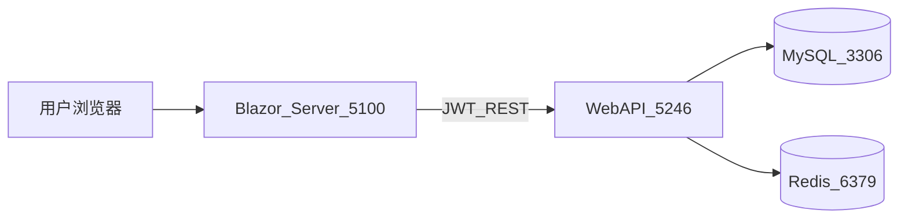
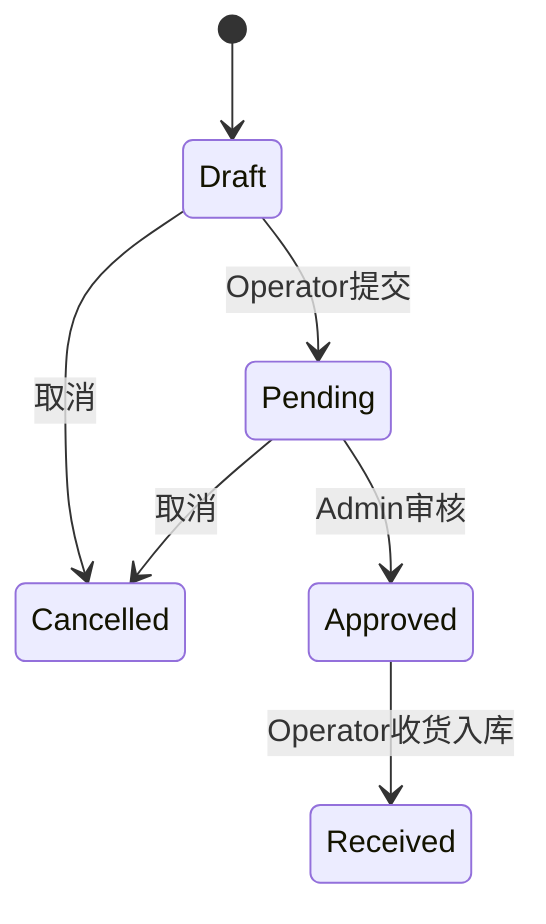
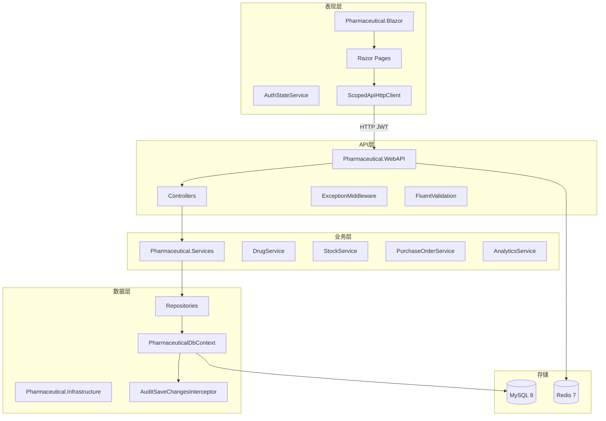
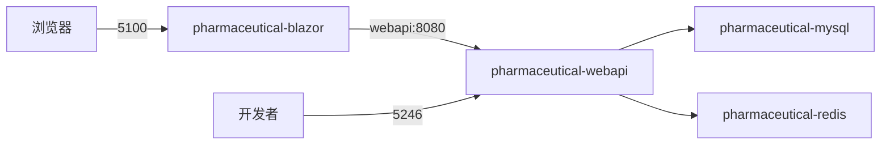
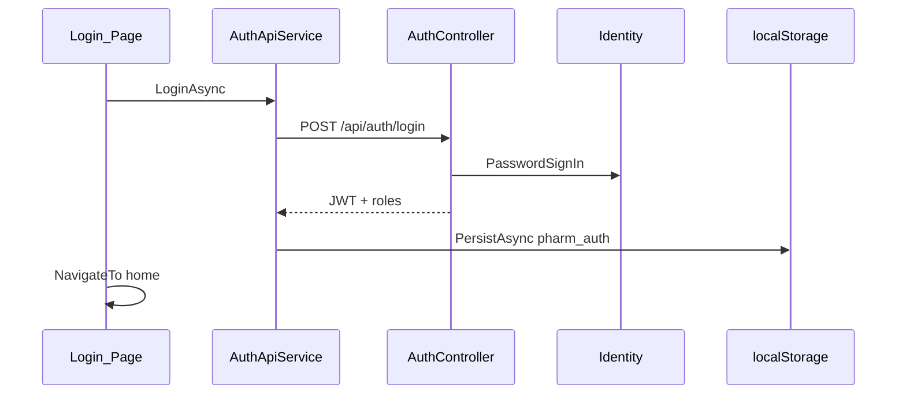
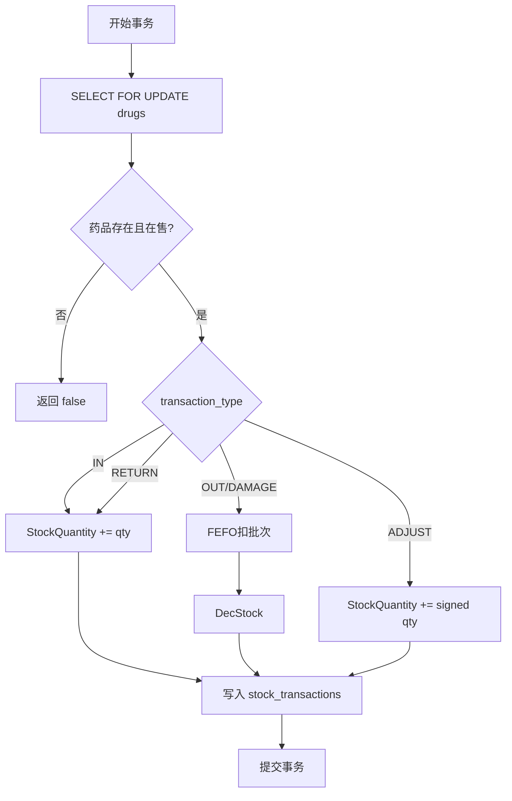
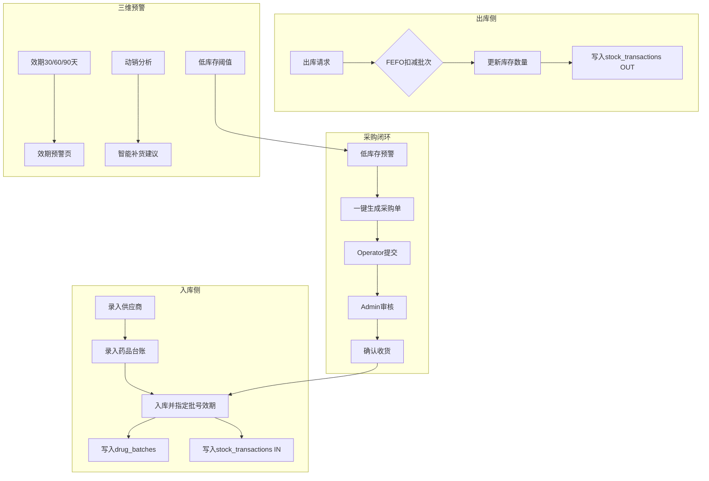
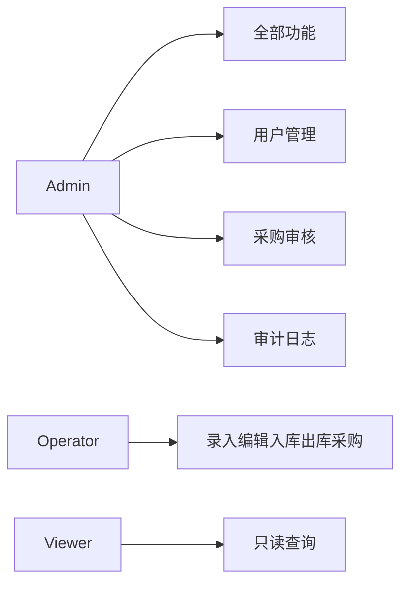
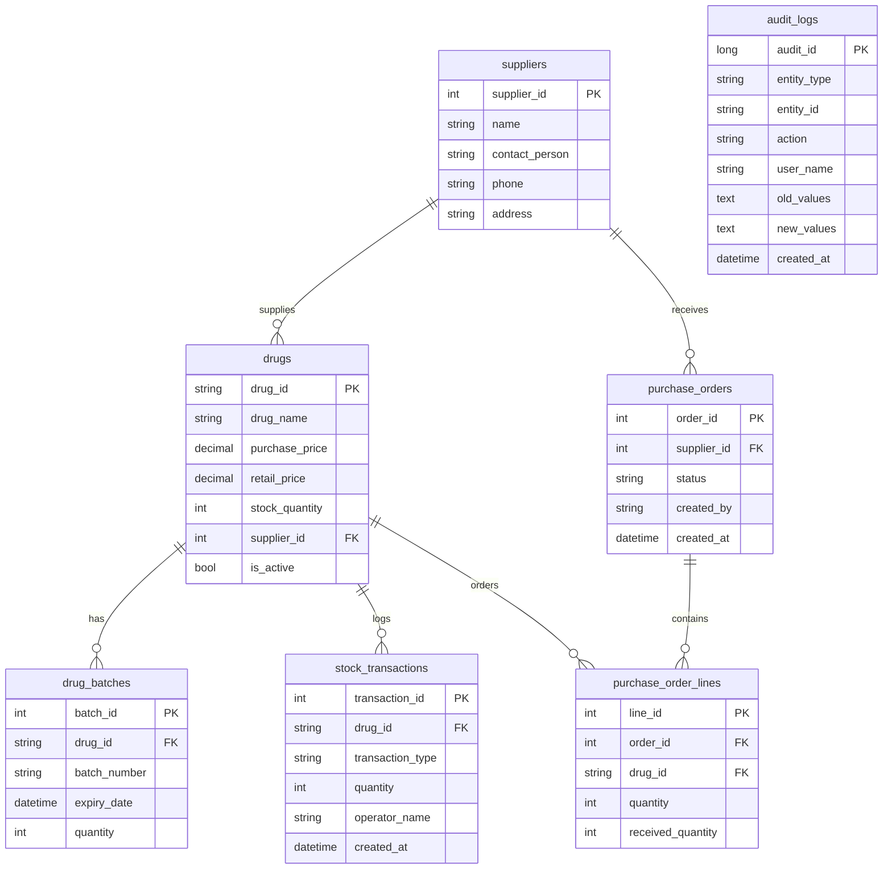

# 药品管理综合系统 — 完整项目文档

| 项目 | 内容 |
|------|------|
| 文档版本 | 1.0（合并版） |
| 编写日期 | 2026-06-28 |
| 说明 | 合并原 docs 目录 8 份 Markdown；Word 版见同目录 .docx |

> **图表说明**：文中 Mermaid 图在 Word 中显示为代码块；完整渲染请用 Markdown 预览。

---

# 第一篇 项目概述

## 1.1 系统简介

基于 .NET 10 的药品进销存管理系统，采用分层架构：Core → Infrastructure → Services → WebAPI，前端为 Blazor Server。

## 1.2 功能模块

| 模块 | 说明 |
|------|------|
| **运营仪表盘** | 库存估值、低库存/临期统计、Top10 动销、智能补货建议 |
| **药品台账** | 录入、编辑、软下架、分页搜索、在售/已下架筛选、CSV 导出 |
| **库存预警** | 低库存监控，可跳转采购单、导出清单 |
| **效期预警** | 30/60/90 天临期批次，支撑 FEFO 策略 |
| **采购单** | 低库存一键生成 → 提交 → Admin 审核 → 收货入库 |
| **入库/出库** | 批次入库、FEFO 出库、流水分页筛选与 CSV 导出 |
| **供应商** | 供应商 CRUD，台账/预警/采购单关联展示 |
| **用户管理** | Admin 创建 Operator / Viewer 账号 |
| **审计日志** | Admin 查看 EF 变更审计（JSON diff） |

## 1.3 系统架构（概要）

```
Blazor Server (UI) ──JWT──▶ WebAPI ──▶ Services ──▶ Repositories ──▶ MySQL
                              │                      │
                              └── Redis (缓存)        └── 审计拦截器
```

## 1.4 创新点（三智一合规）

1. **智预警**：低库存 + 多档效期 + 智能补货三维预警
2. **智出库**：FEFO 批次先到期先出，降低过期损耗
3. **智分析**：运营仪表盘（库存估值、动销 Top10、补货建议）
4. **合规追溯**：库存流水 + EF 变更审计日志

## 1.5 核心业务流程（一句话）

低库存预警 → 一键生成采购单 → Admin 审核 → 收货入库（自动写批次+流水）→ FEFO 出库

## 1.6 角色权限（概要）

| 角色 | 权限概要 |
|------|----------|
| Admin | 全部 + 用户管理 + 审核采购单 + 下架药品 |
| Operator | 录入/编辑/入库出库/创建采购单 |
| Viewer | 只读 |

## 1.7 访问与默认账号

| 地址 | 用途 |
|------|------|
| http://localhost:5100 | Blazor 前端 |
| http://localhost:5246/health | API 健康检查 |

默认账号：`admin` / `Admin@123`；演示账号：`operator1` / `Operator@123`，`viewer1` / `Viewer@123`

---

# 第二篇 需求分析

## 1. 文档说明

### 1.1 文档目的

本文档基于当前已实现代码与部署形态，系统描述药品管理综合系统的**业务背景、用户角色、功能与非功能需求、数据模型、接口契约、业务流程及验收标准**。用于课程答辩、项目验收、测试用例编写及后续迭代的需求基线。

### 1.2 文档范围

| 纳入范围 | 不纳入范围 |
|----------|------------|
| Blazor Server 交互式 UI（`前端页面/Pharmaceutical.Blazor`） | 移动端、微信小程序 |
| REST WebAPI（`Pharmaceutical.WebAPI`） | 第三方 ERP/医保对接 |
| 业务服务层与数据访问层 | 多租户、多库房分布式部署 |
| MySQL 持久化、Redis 缓存 | 生产级高可用集群方案详设 |
| Docker Compose 本地/演示部署 | 详细运维手册（见 MANUAL-STEPS） |

### 1.3 本文档结构

本篇为《药品管理综合系统 — 完整项目文档》**第二篇**；第三篇为系统设计，第四篇为业务流程，第五篇为数据库 ER，第六篇为部署操作，第七篇为答辩材料。

### 1.4 术语表

| 术语 | 英文 | 说明 |
|------|------|------|
| 药品台账 | Drug Catalog | 药品主数据（编码、名称、规格、价格、库存汇总等） |
| 批次 | Batch | 同一药品按生产批号/效期区分的库存明细 |
| 库存流水 | Stock Transaction | 入库、出库、调整、退货、报损等不可变记录 |
| FEFO | First Expiry First Out | 先到期先出库策略 |
| 软下架 | Soft Deactivate | 将 `IsActive=false`，不物理删除 |
| 采购单 | Purchase Order (PO) | 向供应商订货的单据及状态流转 |
| 低库存阈值 | Low Stock Threshold | 默认 200，低于此值触发预警 |
| JWT | JSON Web Token | 无状态 API 鉴权令牌 |
| RBAC | Role-Based Access Control | 基于 Admin/Operator/Viewer 的权限控制 |
| 审计日志 | Audit Log | EF 变更拦截器记录的 JSON 差异 |

---

## 2. 项目背景与建设目标

### 2.1 业务背景

药房、医院库房及药品经销场景普遍面临：

1. **进销存分散**：台账、批次、流水若未统一，难以对账与追溯。
2. **效期风险**：未按批次管理效期时，易积压过期药品造成损耗与合规风险。
3. **补货滞后**：低库存发现晚、采购审批链不清晰，导致断货。
4. **权限与审计**：操作需分角色，关键数据变更需留痕。

### 2.2 建设目标

系统围绕「**三智一合规**」创新点建设：

| 维度 | 目标 |
|------|------|
| 智预警 | 低库存 + 多档效期（30/60/90 天）+ 智能补货建议 |
| 智出库 | 出库/报损按 FEFO 扣减批次 |
| 智分析 | 运营仪表盘：库存估值、动销 Top10、待审采购单概览 |
| 合规追溯 | 全量库存流水 + EF 实体变更审计 |

具体能力目标：

- 建立统一的药品主数据与供应商主数据。
- 支持批次入库、FEFO 出库及多种库存调整类型。
- 打通「低库存 → 采购单 → 审核 → 收货入库」闭环。
- 提供多角色 RBAC 与 JWT 会话管理。
- 支持 CSV 导出与 Docker 一键部署。

### 2.3 成功指标（可验收）

| 编号 | 指标 |
|------|------|
| S-01 | Admin、Operator、Viewer 三类账号均可登录并访问授权范围内功能 |
| S-02 | 运营仪表盘 5 秒内展示 KPI（正常网络与数据量下） |
| S-03 | 完整走通：低库存预警 → 生成采购单 → 提交 → 审核 → 收货 → 出库 |
| S-04 | 药品/流水/低库存/效期 CSV 导出成功 |
| S-05 | Admin 可查看审计日志且含变更前后 JSON |
| S-06 | `GET /health` 与 Docker 健康检查通过 |

---

## 3. 用户角色与权限模型

### 3.1 角色定义

| 角色 | 典型用户 | 职责概述 |
|------|----------|----------|
| **Admin** | 系统管理员、药房主任 | 全功能、用户管理、采购审核、供应商维护、药品下架 |
| **Operator** | 库房操作员 | 药品录入编辑、库存操作、采购单创建/提交/收货 |
| **Viewer** | 查询人员、监管查阅 | 只读：台账、预警、仪表盘、导出 |

### 3.2 默认与演示账号

由 [`DatabaseSeeder`](Pharmaceutical.WebAPI/DatabaseSeeder.cs) 在启动时创建（`SEED_DEMO_DATA=true` 时含演示账号）：

| 用户名 | 密码 | 角色 | 显示名 |
|--------|------|------|--------|
| admin | Admin@123 | Admin | 系统管理员 |
| operator1 | Operator@123 | Operator | 演示操作员 |
| viewer1 | Viewer@123 | Viewer | 演示只读 |

### 3.3 功能权限矩阵

| 功能模块 | Admin | Operator | Viewer |
|----------|:-----:|:--------:|:------:|
| 登录 / 查看仪表盘 | ✓ | ✓ | ✓ |
| 药品台账查询、CSV 导出 | ✓ | ✓ | ✓ |
| 药品录入、编辑 | ✓ | ✓ | ✗ |
| 药品软下架 | ✓ | ✗ | ✗ |
| 低库存/效期预警查看、导出 | ✓ | ✓ | ✓ |
| 一键生成采购单 | ✓ | ✓ | ✗ |
| 采购单创建/提交/收货/取消 | ✓ | ✓ | ✗ |
| 采购单审核 | ✓ | ✗ | ✗ |
| 入库/出库/调整/退货/报损 | ✓ | ✓ | ✗ |
| 库存流水、批次查询、导出 | ✓ | ✓ | ✓ |
| 供应商列表查看 | ✓ | ✓ | ✓ |
| 供应商增删改 | ✓ | ✗ | ✗ |
| 用户管理（注册/改角色/重置密码/删除） | ✓ | ✗ | ✗ |
| 审计日志 | ✓ | ✗ | ✗ |

说明：Blazor UI 通过 `AuthStateService.IsAdmin`、`CanOperate` 控制按钮与导航可见性；**最终以 WebAPI `[Authorize]` 为准**。

### 3.4 安全与账号规则

| 规则 | 说明 |
|------|------|
| 密码策略 | 至少 6 位，含数字、大写、小写；特殊字符非必须 |
| JWT 有效期 | 默认 480 分钟（`JwtSettings.ExpirationMinutes`） |
| 会话存储 | Blazor 端 `localStorage` 键 `pharm_auth`；启动时 `GET /api/auth/me` 校验 |
| 401 处理 | API 返回 401 且本地曾有 token → 清除会话并跳转 `/login?expired=1` |
| 末位 Admin | 不可删除或降级唯一的管理员账号 |
| 当前用户 | 不可删除自己 |
| 无效角色 | 注册/改角色时非 Admin/Operator/Viewer 则回退为 Viewer |

---

## 4. 系统边界与总体架构（需求视角）

### 4.1 系统上下文



### 4.2 逻辑分层

| 层次 | 项目 | 职责 |
|------|------|------|
| 表现层 | Pharmaceutical.Blazor | 页面、导航、表单、图表、会话 |
| API 层 | Pharmaceutical.WebAPI | REST 控制器、鉴权、验证、种子 |
| 业务层 | Pharmaceutical.Services | 药品、库存、采购、分析、导出 |
| 基础设施 | Pharmaceutical.Infrastructure | EF Core、Repository、迁移、审计拦截器 |
| 核心 | Pharmaceutical.Core | 实体、DTO、接口、常量 |

### 4.3 前端架构要点

- **渲染模式**：Blazor Server `InteractiveServerRenderMode`（`prerender: false`）。
- **路由守卫**：`Routes.razor` 完成 `InitializeAsync` 后渲染 Router；`AuthRouteView` 拦截未登录访问。
- **API 调用**：电路内 `ScopedApiHttpClient` 附加 JWT（避免 `DelegatingHandler` 与电路 DI 作用域隔离导致的死锁）。
- **共享 DTO**：前端引用 `Pharmaceutical.Core`，与 API 契约一致。

### 4.4 部署边界

Docker Compose 四服务：mysql、redis、webapi、blazor。详见第 12 章附录。

---

## 5. 功能需求（按模块）

以下各节采用：**功能描述 → 角色 → 前置条件 → 输入/输出 → 业务规则 → 异常与提示 → 页面/API**。

---

### 5.1 认证与会话

**功能描述**：用户通过用户名密码获取 JWT；会话可在刷新后从 localStorage 恢复并经 `auth/me` 校验。

| 项 | 内容 |
|----|------|
| 角色 | 登录为公开；其余接口需认证 |
| 前置条件 | WebAPI 可用；MySQL 中用户已存在 |
| 输入 | 用户名、密码 |
| 输出 | Token、用户名、显示名、角色列表 |
| 业务规则 | 登录成功写入 localStorage；登出清除本地与会话状态 |
| 异常 | 凭证错误提示；token 失效跳转登录并提示「会话已失效」 |
| 页面 | `/login`；`Routes.razor`、`AuthRouteView.razor` |
| API | `POST /api/auth/login`（公开）；`GET /api/auth/me`（已认证） |

---

### 5.2 首页（`/`）

**功能描述**：功能导航 Hub，展示各模块入口、端到端业务流程说明、角色与默认账号说明。

| 项 | 内容 |
|----|------|
| 角色 | 已登录用户；Admin 额外显示用户管理、审计日志卡片 |
| 业务规则 | 不直接调用业务 API，仅导航与说明 |
| 页面 | `Home.razor` |

---

### 5.3 运营仪表盘（`/dashboard`）

**功能描述**：展示运营 KPI、图表与智能补货建议。

| 项 | 内容 |
|----|------|
| 角色 | 全部已认证用户 |
| 输出 KPI | 库存总值、低库存品种数、临期批次数、在售药品数、待审采购单数 |
| 输出分析 | Top10 动销（近 30 天 OUT 汇总）；补货建议（当前库存、日均出库、预计断货天数、建议订货量） |
| 业务规则 | KPI 卡片可跳转至预警、效期、台账、采购单页面 |
| 交互 | Chart.js 柱状图；刷新按钮；加载超时 25 秒提示重试 |
| API | `GET /api/dashboard`；可选查询参数 `expiryDays`（默认 90） |

---

### 5.4 药品台账（`/drugs`）

**功能描述**：药品主数据维护与查询。

| 项 | 内容 |
|----|------|
| 角色 | 查询：全部；录入/编辑：Operator+；下架：Admin |
| 输入 | 药品编码、名称、规格、剂型、批准文号、储存条件、进价/零售价、供应商、初始库存等 |
| 输出 | 分页列表、单条详情 |
| 业务规则 | 库存数量仅通过流水变更，不在编辑表单直接改库存；`IsActive=false` 为软下架；低库存行高亮（阈值来自 `alert-settings`，默认 200） |
| 筛选 | 在售 / 已下架 / 全部；名称或编码搜索 |
| 校验 | `DrugId`、`DrugName` 必填；价格 ≥ 0；库存 ≥ 0；重复 `DrugId` 拒绝 |
| 导出 | `GET /api/export/drugs` → CSV |
| API | `GET/POST/PUT/DELETE /api/drug`；`GET /api/drug/low-stock`；`GET /api/drug/alert-settings` |

---

### 5.5 库存预警（`/alerts`）

**功能描述**：列出库存低于阈值的在售药品。

| 项 | 内容 |
|----|------|
| 角色 | 查看：全部；一键生成采购单：Operator+ |
| 业务规则 | 阈值默认 200；选择供应商后调用 `from-low-stock` 生成 Draft 采购单 |
| 导出 | `GET /api/export/low-stock` |
| API | `GET /api/drug/low-stock`；`POST /api/purchaseorder/from-low-stock?supplierId=` |

---

### 5.6 效期预警（`/expiry-alerts`）

**功能描述**：展示指定天数内到期的批次。

| 项 | 内容 |
|----|------|
| 角色 | 全部已认证用户 |
| 输入 | 档位：30 / 60 / 90 天 |
| 输出 | 药品、批号、效期、数量、预警级别（紧急 ≤30d、警告 ≤60d、提醒其他） |
| 业务规则 | 可跳转至 `/stock?drugId=` 查看批次 |
| 导出 | `GET /api/export/expiry-alerts?withinDays=` |
| API | `GET /api/stock/expiry-alerts?withinDays=` |

---

### 5.7 采购单（`/purchase-orders`）

**功能描述**：采购申请、审批、收货入库全生命周期。

**状态机**：



| 状态 | 含义 | 允许操作（UI） |
|------|------|----------------|
| Draft | 草稿 | Operator+：提交、取消 |
| Pending | 待审核 | Admin：审核；Operator+：取消 |
| Approved | 已审核 | Operator+：收货 |
| Received | 已收货 | 只读 |
| Cancelled | 已取消 | 只读 |

| 项 | 内容 |
|----|------|
| 创建方式 | 低库存一键生成；手工多行（`PurchaseOrderLineEditor`） |
| 收货规则 | 仅 Approved 可收货；按行将未收数量入库并写 IN 流水与批次 |
| 取消规则 | 仅 Draft 或 Pending 可取消（服务层校验） |
| 已知限制 | Submit/Approve 未严格校验前置状态（可从 Draft 直接审核，as-built） |
| API | 见第 7 章采购单接口组 |

---

### 5.8 入库/出库（`/stock`）

**功能描述**：库存操作与流水查询。

| 操作类型 | 代码 | 角色 | 规则摘要 |
|----------|------|------|----------|
| 入库 | IN | Operator+ | 增批次/更新批次数量；增总库存；可自动批号 |
| 出库 | OUT | Operator+ | FEFO 扣批次；库存不足拒绝 |
| 调整 | ADJUST | Operator+ | 数量可为负（盘亏） |
| 退货入库 | RETURN | Operator+ | 增总库存（不强制改批次） |
| 报损 | DAMAGE | Operator+ | 同 OUT，FEFO 扣减 |

| 项 | 内容 |
|----|------|
| 查询 | 流水分页（药品、类型筛选）；按药品查批次 |
| 查询参数 | URL `?drugId=` 可预选批次视图 |
| 并发 | 事务 + 行锁（`SELECT FOR UPDATE`） |
| 导出 | `GET /api/export/transactions` |
| API | `GET /api/stock`；`POST /api/stock/in|out|adjust|return|damage`；`GET /api/stock/batches/{drugId}` |

---

### 5.9 供应商（`/suppliers`）

**功能描述**：供应商主数据维护。

| 项 | 内容 |
|----|------|
| 角色 | 查看：全部；CRUD：Admin |
| 字段 | 名称（必填）、联系人、电话、地址 |
| 业务规则 | 删除时若有关联药品返回 409 Conflict |
| API | `GET/POST/PUT/DELETE /api/supplier` |

---

### 5.10 用户管理（`/users`）

**功能描述**：Admin 管理系统用户。

| 项 | 内容 |
|----|------|
| 角色 | Admin |
| 功能 | 注册新用户；列表展示；行内改角色；重置密码（UI 默认 `Reset@123`）；删除用户 |
| 业务规则 | 见 3.4 安全规则 |
| API | `GET /api/users`；`PUT /api/users/{id}/role`；`DELETE /api/users/{id}`；`POST /api/users/{id}/reset-password`；注册走 `POST /api/auth/register` |

---

### 5.11 审计日志（`/audit-logs`）

**功能描述**：展示 EF 保存时拦截器写入的变更记录。

| 项 | 内容 |
|----|------|
| 角色 | Admin |
| 输出 | 时间、操作人、实体类型、实体 ID、动作、旧值/新值 JSON |
| 默认条数 | 最近 100 条 |
| API | `GET /api/audit?count=100` |

---

## 6. 数据需求

### 6.1 核心实体说明

实体定义见 `Pharmaceutical.Core`；ER 图见 [ER-DIAGRAM.md](ER-DIAGRAM.md)。

#### drugs（药品台账）

| 字段 | 类型 | 说明 |
|------|------|------|
| drug_id | string PK | 药品编码 |
| drug_name | string | 通用名，必填 |
| trade_name | string | 商品名 |
| specification | string | 规格 |
| dosage_form | string | 剂型 |
| approval_num | string | 批准文号 |
| storage_cond | string | 储存条件 |
| purchase_price | decimal | 进价 |
| retail_price | decimal | 零售价 |
| stock_quantity | int | 当前总库存（汇总） |
| supplier_id | int FK | 默认供应商 |
| is_active | bool | 是否在售 |

#### drug_batches（药品批次）

| 字段 | 类型 | 说明 |
|------|------|------|
| batch_id | int PK | 批次 ID |
| drug_id | string FK | 药品编码 |
| batch_number | string | 批号 |
| manufacture_date | datetime? | 生产日期 |
| expiry_date | datetime | 效期（FEFO 排序依据） |
| quantity | int | 批次剩余数量 |

#### stock_transactions（库存流水）

| 字段 | 类型 | 说明 |
|------|------|------|
| transaction_id | int PK | 流水 ID |
| drug_id | string FK | 药品 |
| transaction_type | string | IN/OUT/ADJUST/RETURN/DAMAGE |
| quantity | int | 数量（出库为正数记录） |
| operator_name | string | 操作员 |
| created_at | datetime | 发生时间 |
| remark | string? | 备注 |

#### suppliers（供应商）

| 字段 | 类型 | 说明 |
|------|------|------|
| supplier_id | int PK | 供应商 ID |
| name | string | 名称，必填 |
| contact_person | string | 联系人 |
| phone | string | 电话 |
| address | string | 地址 |

#### purchase_orders / purchase_order_lines（采购单）

| 表 | 关键字段 | 说明 |
|----|----------|------|
| purchase_orders | order_id, supplier_id, status, created_by, created_at, approved_at | 主单 |
| purchase_order_lines | line_id, order_id, drug_id, quantity, received_quantity | 明细行 |

#### audit_logs（审计）

| 字段 | 说明 |
|------|------|
| entity_type, entity_id | 被变更实体 |
| action | Create/Update/Delete |
| old_values, new_values | JSON 快照 |
| user_name, created_at | 操作人与时间 |

#### 用户（AspNetUsers + Identity）

扩展 `AppUser.DisplayName`；角色表 AspNetRoles：`Admin`、`Operator`、`Viewer`。

### 6.2 种子数据

环境变量或配置 `SEED_DEMO_DATA=true` 时：

- 演示用户 operator1、viewer1
- 若库空：3 供应商、12 药品、14 批次（含临期）、约 50 条流水、5 张采购单（各状态）、12 条审计样例
- 若已有药品：仅补充审计与取消态采购单

---

## 7. 接口需求摘要

### 7.1 通用约定

- **Base URL**：`http://localhost:5246`（Docker 映射）；Blazor 容器内为 `http://webapi:8080/`。
- **鉴权**：除登录与健康检查外，请求头 `Authorization: Bearer {token}`。
- **响应信封**：`ApiResponse<T>` — `success`、`data`、`message`。
- **分页**：`PagedResult<T>` — `items`、`totalCount`、`page`、`pageSize`；page ≥ 1，pageSize 1–100，默认 20。

### 7.2 接口清单

| 方法 | 路径 | 角色要求 | 说明 |
|------|------|----------|------|
| GET | `/health` | 公开 | 健康检查 |
| POST | `/api/auth/login` | 公开 | 登录 |
| GET | `/api/auth/me` | 已认证 | 当前用户 |
| POST | `/api/auth/register` | Admin | 注册用户 |
| GET | `/api/dashboard` | 已认证 | 运营仪表盘 |
| GET | `/api/drug` | 已认证 | 分页列表 |
| GET | `/api/drug/{id}` | 已认证 | 药品详情 |
| GET | `/api/drug/low-stock` | 已认证 | 低库存列表 |
| GET | `/api/drug/alert-settings` | 已认证 | 预警阈值配置 |
| POST | `/api/drug` | Admin, Operator | 新增药品 |
| PUT | `/api/drug/{id}` | Admin, Operator | 更新药品 |
| DELETE | `/api/drug/{id}` | Admin | 软下架 |
| GET | `/api/stock` | 已认证 | 流水分页 |
| GET | `/api/stock/batches/{drugId}` | 已认证 | 批次列表 |
| GET | `/api/stock/expiry-alerts` | 已认证 | 效期预警 |
| POST | `/api/stock/in` | Admin, Operator | 入库 |
| POST | `/api/stock/out` | Admin, Operator | 出库 |
| POST | `/api/stock/adjust` | Admin, Operator | 调整 |
| POST | `/api/stock/return` | Admin, Operator | 退货入库 |
| POST | `/api/stock/damage` | Admin, Operator | 报损 |
| GET | `/api/supplier` | 已认证 | 供应商列表 |
| GET | `/api/supplier/{id}` | 已认证 | 供应商详情 |
| POST | `/api/supplier` | Admin | 新增供应商 |
| PUT | `/api/supplier/{id}` | Admin | 更新供应商 |
| DELETE | `/api/supplier/{id}` | Admin | 删除供应商 |
| GET | `/api/purchaseorder` | 已认证 | 采购单列表 |
| GET | `/api/purchaseorder/{id}` | 已认证 | 采购单详情 |
| POST | `/api/purchaseorder` | Admin, Operator | 手工创建 |
| POST | `/api/purchaseorder/from-low-stock` | Admin, Operator | 低库存生成 |
| POST | `/api/purchaseorder/{id}/submit` | Admin, Operator | 提交 |
| POST | `/api/purchaseorder/{id}/approve` | Admin | 审核 |
| POST | `/api/purchaseorder/{id}/receive` | Admin, Operator | 收货入库 |
| POST | `/api/purchaseorder/{id}/cancel` | Admin, Operator | 取消 |
| GET | `/api/export/drugs` | 已认证 | 导出药品 CSV |
| GET | `/api/export/transactions` | 已认证 | 导出流水 CSV |
| GET | `/api/export/low-stock` | 已认证 | 导出低库存 CSV |
| GET | `/api/export/expiry-alerts` | 已认证 | 导出效期 CSV |
| GET | `/api/audit` | Admin | 审计日志 |
| GET | `/api/users` | Admin | 用户列表 |
| PUT | `/api/users/{id}/role` | Admin | 修改角色 |
| DELETE | `/api/users/{id}` | Admin | 删除用户 |
| POST | `/api/users/{id}/reset-password` | Admin | 重置密码 |

---

## 8. 非功能需求

### 8.1 性能

| 编号 | 需求 |
|------|------|
| NF-P01 | WebAPI `/health` 响应 &lt; 1s |
| NF-P02 | 仪表盘 API 常规数据量下 &lt; 3s（实测约百毫秒级） |
| NF-P03 | Blazor HttpClient 超时 30s；仪表盘页面加载超时提示 25s |
| NF-P04 | Redis 用于缓存（连接在 `ConnectionStrings:RedisConnection`） |

### 8.2 安全

| 编号 | 需求 |
|------|------|
| NF-S01 | JWT Bearer 鉴权；密钥通过环境变量 `JWT_SECRET` 配置（≥32 字符） |
| NF-S02 | 密码哈希存储（ASP.NET Identity） |
| NF-S03 | HTTPS 重定向（Docker 可 `DISABLE_HTTPS_REDIRECT=true`） |
| NF-S04 | Blazor 使用电路内 `ScopedApiHttpClient` 传递 token，避免 Handler 作用域问题 |
| NF-S05 | Token 与认证数据不暴露给客户端 WASM（Blazor Server 服务端持有） |

### 8.3 可用性

| 编号 | 需求 |
|------|------|
| NF-U01 | 各数据页提供 Loading、空状态、错误提示与重试 |
| NF-U02 | 会话失效统一跳转登录并提示 |
| NF-U03 | 中文 UI；侧栏导航固定模块入口 |

### 8.4 可维护性

| 编号 | 需求 |
|------|------|
| NF-M01 | 分层架构 Core / Infrastructure / Services / WebAPI / Blazor |
| NF-M02 | DTO 与实体分离；FluentValidation 校验 |
| NF-M03 | EF Core Migrations 管理 schema |

### 8.5 可部署性

| 编号 | 需求 |
|------|------|
| NF-D01 | `docker compose up` 一键启动四容器 |
| NF-D02 | mysql/redis/webapi/blazor 均配置 healthcheck |
| NF-D03 | 数据持久化卷 `mysql_data`、`blazor_dp_keys` |

### 8.6 可测试性

| 编号 | 需求 |
|------|------|
| NF-T01 | `Pharmaceutical.Tests` 单元/集成测试 |
| NF-T02 | `scripts/self-test-api.ps1` 13 项 API 冒烟脚本 |
| NF-T03 | CI 配置 MySQL 服务容器（`.github/workflows/ci.yml`） |

---

## 9. 业务流程需求

### 9.1 主流程：进销存与采购闭环

1. **建档**：Admin 维护供应商；Operator 录入药品台账（可带初始库存）。
2. **入库**：Operator 在入库页录入批号、效期、数量 → 写入 `drug_batches` 与 IN 流水。
3. **监控**：系统按阈值展示低库存；按 30/60/90 天展示效期预警；仪表盘展示补货建议。
4. **补货**：Operator 从预警页或仪表盘跳转，选择供应商生成采购单（Draft）。
5. **审批**：Operator 提交 → Pending；Admin 审核 → Approved。
6. **收货**：Operator 收货 → 按行入库 → Received；自动增加批次与 IN 流水。
7. **出库**：Operator 在出库页选择药品与数量 → FEFO 扣批次 → OUT 流水。

文字流程与 [BUSINESS-FLOW.md](BUSINESS-FLOW.md) 一致。

### 9.2 子流程：药品下架

Admin 在台账页下架 → `IsActive=false` → 不参与低库存与在售统计（`activeOnly` 筛选）。

### 9.3 子流程：用户与审计

Admin 创建 Operator/Viewer → 分配角色 → 业务操作产生审计日志 → Admin 在审计页追溯变更。

---

## 10. 约束、假设与已知限制

### 10.1 假设

- 单库房、单组织、无多租户隔离。
- 操作员人数有限，并发写冲突通过数据库行锁处理即可。
- 界面语言为简体中文。
- 演示与教学场景为主，非医疗 HIS 正式投产环境。

### 10.2 技术约束

- .NET 10、ASP.NET Core、Blazor Server、EF Core 8+、MySQL 8.0、Redis 7。
- 浏览器需支持 WebSocket（Blazor Server 电路）。

### 10.3 已知限制（As-Built）

| 编号 | 限制 |
|------|------|
| L-01 | UI 权限隐藏不等于 API 授权，越权须靠 API 403 |
| L-02 | 采购单 Submit/Approve 未强制校验上一状态 |
| L-03 | Viewer 无任何写操作入口 |
| L-04 | 退货入库不强制维护批次明细 |
| L-05 | 重置密码 UI 固定为 `Reset@123`，生产环境需改进 |

---

## 11. 验收标准与测试要点

### 11.1 按角色验收用例

| 用例 ID | 角色 | 步骤 | 期望结果 |
|---------|------|------|----------|
| AC-01 | admin | 登录 → 仪表盘 | KPI 与图表正常 |
| AC-02 | admin | 用户管理列表 | 用户展示，角色下拉可改 |
| AC-03 | admin | 审核 Pending 采购单 | 状态变 Approved |
| AC-04 | operator1 | 登录 → 录入药品 | 成功 |
| AC-05 | operator1 | 访问 `/api/users` | HTTP 403 |
| AC-06 | operator1 | 出库数量 &gt; 库存 | 失败提示 |
| AC-07 | viewer1 | 登录 → 台账只读 | 无录入/编辑按钮 |
| AC-08 | viewer1 | POST 入库 API | HTTP 403 |
| AC-09 | 任意 | 会话过期后访问数据页 | 跳转登录 expired=1 |
| AC-10 | admin | 审计日志 | 可见 JSON 变更 |

### 11.2 部署验收

```powershell
docker compose up -d --build
curl http://localhost:5246/health
# 期望 200
powershell -File scripts\self-test-api.ps1
# 期望 13/13 passed
```

### 11.3 关键页面稳定性

| 页面 | 验收点 |
|------|--------|
| `/dashboard` | 无永久 Loading；Blazor 日志有 dashboard End 200 |
| `/users` | 无 InputSelect 电路崩溃 |
| `/purchase-orders` | 手工创建多行无 bind 异常 |

---

## 12. 附录

### 12.1 环境变量（`.env` 示例）

| 变量 | 说明 |
|------|------|
| MYSQL_ROOT_PASSWORD | MySQL root 密码 |
| MYSQL_DATABASE | 库名，默认 pharmaceutical |
| JWT_SECRET | JWT 签名密钥（≥32 字符） |
| SEED_DEMO_DATA | `true` 时种子演示数据 |

### 12.2 端口与服务

| 服务 | 容器名 | 端口 |
|------|--------|------|
| Blazor | pharmaceutical-blazor | 5100 → 8080 |
| WebAPI | pharmaceutical-webapi | 5246 → 8080 |
| MySQL | pharmaceutical-mysql | 3306 |
| Redis | pharmaceutical-redis | 6379 |

### 12.3 前端路由一览

| 路由 | 页面 | 最低权限 |
|------|------|----------|
| `/login` | 登录 | 公开 |
| `/` | 首页 | 已认证 |
| `/dashboard` | 运营仪表盘 | 已认证 |
| `/drugs` | 药品台账 | 已认证 |
| `/alerts` | 库存预警 | 已认证 |
| `/expiry-alerts` | 效期预警 | 已认证 |
| `/purchase-orders` | 采购单 | 已认证 |
| `/suppliers` | 供应商 | 已认证 |
| `/stock` | 入库出库 | 已认证 |
| `/users` | 用户管理 | Admin（页面级） |
| `/audit-logs` | 审计日志 | Admin（页面级） |

### 12.4 文档修订记录

| 版本 | 日期 | 说明 |
|------|------|------|
| 1.0 | 2026-06-28 | 首版，基于当前代码库逆向整理 |

---

*本文档描述的是系统当前实现的需求基线。功能扩展（如严格 PO 状态机、多库房、审批流配置化）应在本版本基础上增量修订。*

---

# 第三篇 系统设计

## 1. 文档说明

### 1.1 目的

本文档描述药品管理综合系统的**技术架构、分层设计、模块职责、数据设计、安全机制、关键算法与部署方案**，作为开发实现、代码评审与答辩技术说明的依据。

### 1.2 范围

覆盖 `Pharmaceutical.Core`、`Pharmaceutical.Infrastructure`、`Pharmaceutical.Services`、`Pharmaceutical.WebAPI`、`Pharmaceutical.Blazor` 及 Docker 编排，不展开第三方 MySQL/Redis 内核实现。

### 1.3 设计原则

| 原则 | 说明 |
|------|------|
| 分层解耦 | 表现层 / API / 业务 / 数据访问 / 领域模型分离 |
| 领域驱动边界 | 实体与 DTO 分离，Repository 屏蔽 EF 细节 |
| 安全默认 | API 默认需 JWT；写操作按角色授权 |
| 可追溯 | 库存流水不可变；EF 变更自动审计 |
| 批次一致性 | 总库存与批次联动；出库 FEFO |
| 可部署 | Docker Compose 一键启动，健康检查完备 |

---

## 2. 设计概述

### 2.1 系统定位

面向药房/库房场景的 **B/S 架构进销存管理系统**：Blazor Server 提供交互 UI，ASP.NET Core WebAPI 提供 REST 服务，MySQL 持久化，Redis 作分布式缓存后端。

### 2.2 逻辑架构



### 2.3 物理部署架构



| 容器 | 镜像/构建 | 端口映射 | 职责 |
|------|-----------|----------|------|
| pharmaceutical-blazor | Dockerfile.blazor | 5100→8080 | Blazor Server UI |
| pharmaceutical-webapi | Dockerfile | 5246→8080 | REST API |
| pharmaceutical-mysql | mysql:8.0 | 3306 | 业务库 + Identity |
| pharmaceutical-redis | redis:7-alpine | 6379 | 分布式缓存 |

---

## 3. 技术选型

| 类别 | 技术 | 版本/说明 |
|------|------|-----------|
| 运行时 | .NET | 10 |
| Web 框架 | ASP.NET Core | WebAPI + Blazor Server |
| ORM | Entity Framework Core | MySQL Provider (Pomelo) |
| 数据库 | MySQL | 8.0 |
| 缓存 | Redis + IDistributedCache | StackExchange.Redis |
| 身份认证 | ASP.NET Identity + JWT Bearer | 角色 RBAC |
| 校验 | FluentValidation | 自动模型验证 |
| 日志 | Serilog | 控制台 + 请求日志 |
| API 文档 | Swagger / OpenAPI | 开发环境启用 |
| 健康检查 | AspNetCore.HealthChecks | MySQL + Redis + `/health` |
| 前端图表 | Chart.js | CDN 4.4.1 |
| 容器 | Docker Compose | 四服务编排 |

---

## 4. 项目结构与分层设计

### 4.1 解决方案结构

```
Pharmaceutical.Core/              # 领域实体、DTO、接口、常量、配置类
Pharmaceutical.Infrastructure/    # EF DbContext、Repository、迁移、审计拦截器
Pharmaceutical.Services/          # 业务服务实现
Pharmaceutical.WebAPI/            # REST 控制器、中间件、种子、验证器
前端页面/Pharmaceutical.Blazor/   # Blazor Server UI
Pharmaceutical.Tests/             # 单元/集成测试
docs/                             # 需求、设计、流程文档
scripts/                          # 种子脚本、API 自测
```

### 4.2 各层职责

| 层次 | 项目 | 职责 | 禁止事项 |
|------|------|------|----------|
| 表现层 | Blazor | 路由、表单、状态展示、调用 API | 直接访问数据库 |
| API 层 | WebAPI | HTTP 适配、鉴权声明、DTO 入参出参 | 复杂业务逻辑 |
| 业务层 | Services | 业务规则、流程编排、DTO 映射 | 直接 SQL（除 Repository 透传） |
| 数据层 | Infrastructure | EF 映射、查询、事务、拦截器 | UI/API 逻辑 |
| 核心层 | Core | 实体、契约、无实现依赖 | 引用 Infrastructure |

### 4.3 依赖方向

```
Blazor → Core (DTO)
WebAPI → Services → Infrastructure → Core
Services → Core (Interfaces)
Infrastructure → Core
```

Blazor **不引用** Services/Infrastructure，仅通过 HTTP 与 WebAPI 通信（DTO 共享自 Core）。

---

## 5. 模块设计

### 5.1 认证与授权模块

**组件**：`AuthController`、`UsersController`、`AuthStateService`、`ScopedApiHttpClient`

**登录流程**：



**JWT 生成**（`AuthController`）：

- Claims：`NameIdentifier`、`Name`、`display_name`、`Role`（每角色一条）
- 配置：`JwtSettings` — Issuer、Audience、Secret、ExpirationMinutes（默认 480）

**Blazor 会话恢复**（`AuthStateService.InitializeAsync`）：

1. 从 `localStorage` 读取 `pharm_auth`（3 秒 JS 超时保护）
2. 若有 token，调用 `GET /api/auth/me`（`ApiRaw` 客户端，无 Handler）
3. 失败则 `ClearLocalAuthAsync`
4. `finally` 中 `TrySetResult` 释放 `WhenInitialized`

**API 调用鉴权**（`ScopedApiHttpClient`）：

- 与页面共享 Scoped `AuthStateService`，避免 `DelegatingHandler` 在 `IHttpClientFactory` 独立 DI 作用域中拿到错误 AuthState 实例（曾导致仪表盘永久加载）
- 401 且曾有 token → 异步 `NotifyUnauthorizedAsync` → 跳转 `/login?expired=1`

### 5.2 药品台账模块

**类**：`DrugController` → `DrugService` → `DrugRepository`

| 操作 | 设计要点 |
|------|----------|
| 分页查询 | `GetPagedAsync(search, page, pageSize, activeOnly)` |
| 低库存 | `StockQuantity < threshold`，仅 `IsActive` |
| 新增 | 校验重复 `DrugId`；可带初始库存触发 IN 逻辑 |
| 更新 | 不允许通过此接口改 `StockQuantity` |
| 下架 | `DELETE` 设 `IsActive=false` |

**校验**：`DrugCreateDtoValidator`、`DrugUpdateDtoValidator`（FluentValidation）

### 5.3 库存与批次模块

**类**：`StockController` → `StockService` → `StockRepository` + `DrugBatchRepository`

**事务处理**（`StockRepository.ProcessTransactionAsync`）：



**FEFO 算法**（`DrugBatchRepository.DeductFefoAsync`）：

1. 查询 `drug_id` 下 `quantity > 0` 的批次
2. 按 `expiry_date` 升序排序
3. 依次扣减直至满足出库数量；任一批次不足则整体失败

**入库批次**（`StockService.StockInAsync`）：

- 调用 `AddOrUpdateBatchAsync`：同药品+批号则累加数量，否则新建批次
- 默认效期 +2 年（采购收货场景可指定）

### 5.4 采购单模块

**类**：`PurchaseOrderController` → `PurchaseOrderService` → `PurchaseOrderRepository`

**状态与仓储**：

| 状态 | 常量 | 持久化字段 |
|------|------|------------|
| 草稿 | Draft | `purchase_orders.status` |
| 待审 | Pending | |
| 已审 | Approved | `approved_at` 可选 |
| 已收货 | Received | |
| 已取消 | Cancelled | |

**低库存生成算法**（`CreateFromLowStockAsync`）：

- 筛选：`StockQuantity < threshold` 且 `SupplierId` 匹配
- 行数量：`max(threshold - stock, 10)`

**收货入库**（`ReceiveAsync`）：

- 前置：`Status == Approved`
- 每行：`remaining = Quantity - ReceivedQuantity`
- 调用 `StockInAsync` 写入 IN 流水与批次
- 批号默认 `PO-{orderId}-{drugId}`

**设计备注**：`SubmitAsync`/`ApproveAsync` 当前仅更新状态字段，未强制校验上一状态（见需求文档已知限制 L-02）。

### 5.5 分析与仪表盘模块

**类**：`DashboardController` → `AnalyticsService` → `AnalyticsRepository`

**DashboardDto 聚合逻辑**：

| 指标 | 数据来源 |
|------|----------|
| TotalInventoryValue | `SUM(purchase_price * stock_quantity)` 在售药品 |
| LowStockCount | 低于阈值品种数 |
| ExpiryAlertCount | 效期预警批次数 |
| ActiveDrugCount | `IsActive=true` 计数 |
| PendingPurchaseOrders | `Status=Pending` 计数 |
| TopMovingDrugs | 近 30 天 OUT 流水 GROUP BY drug_id TOP 10 |
| ReorderSuggestions | 低库存品种 + 动销推算 |

**补货建议算法**（简化）：

```
dailyAvg = totalOut30d / 30  （无动销则取 1）
daysUntilStockout = currentStock / dailyAvg
suggestedQty = max(dailyAvg * 14, threshold - currentStock)
```

### 5.6 供应商模块

`SupplierController` → `SupplierService` → `SupplierRepository`

- 删除前检查是否有关联 `drugs`，有则返回 409 Conflict

### 5.7 审计模块

**拦截器**：`AuditSaveChangesInterceptor`（EF `SaveChangesInterceptor`）

- 触发时机：每次 `SaveChanges`/`SaveChangesAsync`
- 条件：存在 `HttpContext` 且实体非 `AuditLogEntity`
- 记录：`EntityType`、`EntityId`、`Action`（Create/Update/Delete）、`OldValues`/`NewValues` JSON、`UserName` 来自 JWT

**查询**：`AuditController` → `AuditService` → `AuditLogRepository.GetRecentAsync`

### 5.8 导出模块

`ExportController` → `ExportService`

- 生成 UTF-8 CSV 字节流，`File()` 返回下载
- 大数据量采用单次查询上限（如 10000 行）— 演示级设计

---

## 6. 数据库设计

### 6.1 ER 关系

详见 [ER-DIAGRAM.md](ER-DIAGRAM.md)。核心关系：

- `suppliers` 1:N `drugs`、`purchase_orders`
- `drugs` 1:N `drug_batches`、`stock_transactions`、`purchase_order_lines`
- `purchase_orders` 1:N `purchase_order_lines`

### 6.2 表设计摘要

| 表名 | 主键 | 重要索引/约束 |
|------|------|----------------|
| drugs | drug_id (varchar) | FK supplier_id；is_active |
| drug_batches | batch_id (int) | UNIQUE (drug_id, batch_number) |
| stock_transactions | transaction_id | FK drug_id；按 created_at 查询 |
| suppliers | supplier_id | name required |
| purchase_orders | order_id | FK supplier_id；status |
| purchase_order_lines | line_id | FK order_id, drug_id |
| audit_logs | audit_id (bigint) | 按 created_at 降序 |
| AspNetUsers / Roles | Identity 标准表 | 与 AppUser 扩展 DisplayName |

### 6.3 迁移与种子

- 迁移目录：`Pharmaceutical.Infrastructure/Migrations/`
- 启动种子：`DatabaseSeeder.SeedAsync`（非 Testing 环境）
  - 角色与 admin 用户
  - `SEED_DEMO_DATA=true`：演示用户、药品、批次、流水、采购单、审计样例

### 6.4 一致性策略

| 场景 | 策略 |
|------|------|
| 库存变更 | 单事务 + `FOR UPDATE` 行锁 |
| 总库存 vs 批次 | OUT/DAMAGE 必须 FEFO 成功才减总库存 |
| 软删除 | `is_active` 标记，保留历史流水 |

---

## 7. 接口设计（架构视角）

### 7.1 REST 风格

- 资源路径：`/api/{controller}`，动作型子路径如 `/submit`、`/receive`
- 统一响应：

```json
{
  "success": true,
  "data": { },
  "message": "可选说明"
}
```

### 7.2 分页约定

`PagedResult<T>`：`items`、`totalCount`、`page`、`pageSize`；服务端限制 pageSize ∈ [1,100]。

### 7.3 错误处理

| 层级 | 机制 |
|------|------|
| 验证错误 | FluentValidation → 400 + errors 对象 |
| 业务失败 | `ApiResponse.Fail(message)` → 400/404 |
| 未捕获异常 | `ExceptionMiddleware` → 500 统一 JSON |
| 鉴权失败 | 401/403 标准 HTTP 状态 |

完整接口清单见 [需求分析.md 第 7 章](需求分析.md#72-接口清单)。

---

## 8. 前端设计（Blazor Server）

### 8.1 渲染与路由

- `App.razor`：`Routes` 组件，`InteractiveServerRenderMode(prerender: false)`
- `Routes.razor`：先 `InitializeAsync` 再渲染 `Router`（避免未初始化时发起鉴权 API）
- `AuthRouteView`：未登录重定向 `/login`（`forceLoad` 用于会话失效）

### 8.2 页面与组件

| 类型 | 代表 |
|------|------|
| 页面 | `Dashboard.razor`、`Drugs.razor`、`Stock.razor` 等 11 个业务页 |
| 布局 | `MainLayout`、`NavMenu`、`LoginLayout` |
| 共享组件 | `AlertBanner`、`LoadingSpinner`、`Pagination`、`PurchaseOrderLineEditor` |
| JS 互操作 | `download.js`（CSV）、`charts.js`（Chart.js） |

### 8.3 状态管理

- **电路级 Scoped**：`AuthStateService`、各 `ApiService`、`ScopedApiHttpClient`
- **持久化**：`localStorage.pharm_auth` JSON（token、username、displayName、roles）
- **UI 刷新**：`AuthChanged` 事件驱动 `NavMenu`/`Home` 重绘

### 8.4 API 服务分层

```
Pages → XxxApiService → ScopedApiHttpClient → IHttpClientFactory("ApiRaw") → WebAPI
Login → AuthApiService → HttpClient（无 JWT）
```

---

## 9. 安全设计

### 9.1 威胁与对策

| 威胁 | 对策 |
|------|------|
| 未授权 API 访问 | JWT Bearer + `[Authorize(Roles=...)]` |
| 密码明文存储 | Identity PasswordHasher |
| 弱密码 | 长度与字符类策略 |
| 会话劫持 | HTTPS（可配置）；Token 有效期 |
| 越权 UI 操作 | API 层二次校验角色 |
| 并发超卖 | 数据库行锁 + 事务 |
| 审计缺失 | EF SaveChanges 拦截器 |

### 9.2 密钥与配置

| 配置项 | 来源 |
|--------|------|
| JWT Secret | `JwtSettings:Secret` 或环境变量 `JWT_SECRET` |
| 数据库 | `ConnectionStrings:DefaultConnection` |
| Redis | `ConnectionStrings:RedisConnection` |
| 低库存阈值 | `AlertSettings:LowStockThreshold`（默认 200） |

### 9.3 CORS

开发策略 `AllowBlazor`：允许 `localhost:5100` 带来源凭证（Blazor 直连 API 场景）。

---

## 10. 非功能设计

### 10.1 性能

- Redis 缓存接口注册（具体热点缓存可按业务扩展）
- 仪表盘多查询聚合，常规数据量下百毫秒级
- Blazor HttpClient Timeout 30s；仪表盘 UI 25s 取消提示

### 10.2 可观测性

- Serilog 请求日志：`UseSerilogRequestLogging`
- 健康检查：`/health` 检测 MySQL、Redis
- Docker healthcheck 与 `depends_on: service_healthy`

### 10.3 可测试性

- `Pharmaceutical.Tests`：xUnit + WebApplicationFactory
- CI：GitHub Actions + MySQL service container
- `scripts/self-test-api.ps1`：13 项冒烟

---

## 11. 部署设计

### 11.1 Docker 镜像

| 镜像 | 基础 | 构建 |
|------|------|------|
| webapi | `aspnet:10.0` | 多阶段 `Dockerfile`，发布 WebAPI |
| blazor | `aspnet:10.0` | 多阶段 `Dockerfile.blazor`，发布 Blazor |

### 11.2 环境变量（docker-compose）

| 变量 | 服务 | 作用 |
|------|------|------|
| ConnectionStrings__DefaultConnection | webapi | MySQL 连接 |
| ConnectionStrings__RedisConnection | webapi | Redis |
| JwtSettings__Secret | webapi | JWT 签名 |
| SEED_DEMO_DATA | webapi | 演示种子 |
| ApiSettings__BaseUrl | blazor | `http://webapi:8080/` |
| DISABLE_HTTPS_REDIRECT | blazor | 容器内 HTTP |

### 11.3 启动顺序

```
mysql healthy → redis healthy → webapi healthy → blazor start
```

### 11.4 数据卷

- `mysql_data`：数据库持久化
- `blazor_dp_keys`：Data Protection 密钥（Blazor 电路）

---

## 12. 扩展性与技术债

### 12.1 可扩展点

| 方向 | 建议 |
|------|------|
| 多库房 | 增加 `warehouse_id` 维度，库存与批次按库划分 |
| 严格 PO 状态机 | Service 层校验状态转移表 |
| 消息通知 | 低库存/效期 Webhook 或邮件 |
| 读写分离 | Repository 接口不变，只读走副本 |
| Blazor WASM | 需重新设计 token 与 API 调用方式 |

### 12.2 已知技术债

| 编号 | 描述 |
|------|------|
| TD-01 | PO Submit/Approve 无严格前置状态校验 |
| TD-02 | 退货入库不维护批次明细 |
| TD-03 | 导出单次上限 10000 行，无流式导出 |
| TD-04 | UI 权限与 API 权限需双重维护 |
| TD-05 | 补货算法为演示级启发式，非 ML/统计预测 |

---

## 13. 附录

### 13.1 核心类索引

| 领域 | 接口 | 实现 |
|------|------|------|
| 药品 | IDrugService | DrugService |
| 库存 | IStockService | StockService |
| 采购 | IPurchaseOrderService | PurchaseOrderService |
| 分析 | IAnalyticsService | AnalyticsService |
| 审计 | IAuditService | AuditService |
| 导出 | IExportService | ExportService |

### 13.2 文档修订记录

| 版本 | 日期 | 说明 |
|------|------|------|
| 1.0 | 2026-06-28 | 首版，与代码库 .NET 10 / ScopedApiHttpClient 实现对齐 |

---

*本文档描述系统当前实现的设计基线。架构变更时请同步更新本文档与 第二篇。*

---

# 第四篇 业务流程

## 进销存主流程



## 角色与权限



## 演示自检路径

1. 登录 http://localhost:5100（admin / Admin@123）
2. 运营仪表盘 — 查看 KPI 与图表
3. 效期预警 — 确认临期批次
4. 低库存预警 — 导出 CSV
5. 采购单 — 生成 → 提交 → 审核 → 收货
6. 入库出库 — 流水筛选与导出
7. 审计日志（Admin）— 查看变更记录

---

# 第五篇 数据库设计



## 说明

- **库存一致性**：`drugs.stock_quantity` 仅通过 `stock_transactions` 与批次扣减联动变更，编辑药品不可直接改库存。
- **FEFO**：出库时按 `drug_batches.expiry_date` 先到期先扣减。
- **软下架**：`drugs.is_active = false` 表示下架，非物理删除。

---

# 第六篇 部署与操作

项目路径：`D:\study\药品管理系统\-sj`  
推荐运行方式：**Docker**（本机无 .NET 10 SDK 时不要用 `dotnet run`）。

---

## 阶段 A：环境与首次启动（必做）

### A1 进入目录

```powershell
cd "D:\study\药品管理系统\-sj"
```

### A2 配置 `.env`

```powershell
copy .env.example .env
```

编辑 `.env`：

| 变量 | 说明 |
|------|------|
| `MYSQL_ROOT_PASSWORD` | MySQL 强密码 |
| `JWT_SECRET` | 至少 32 字符随机串 |
| `SEED_DEMO_DATA` | 首次建议 `true`（自动演示数据） |

`.env` 不会提交 Git。

### A3 检查端口

默认占用：5100（前端）、5246（API）、3306（MySQL）、6379（Redis）。冲突时停本机服务或改 `docker-compose.yml` 端口映射。

**重要：** Docker 全栈与本地 `dotnet run` **不能同时占用 5100/5246**。若要用本地调试，先停容器里的前端和 API：

```powershell
docker compose stop blazor webapi
docker compose up -d mysql redis
```

或一键准备本地环境：

```powershell
.\scripts\start-local.ps1
```

### A4 启动

```powershell
docker compose up -d --build
docker compose ps
docker compose logs webapi --tail 30
```

### A5 访问

| 地址 | 用途 |
|------|------|
| http://localhost:5100 | **Blazor 前端（用这个）** |
| http://localhost:5246/health | API 健康检查 |

### A6 登录

| 账号 | 密码 | 角色 |
|------|------|------|
| `admin` | `Admin@123` | Admin |
| `operator1` | `Operator@123` | Operator（种子自动创建） |
| `viewer1` | `Viewer@123` | Viewer（种子自动创建） |

---

## 阶段 A2b：本地 dotnet run（可选，需 .NET 10 SDK）

与 Docker 全栈二选一，或只让 Docker 跑 MySQL/Redis。

### 步骤

1. 确保 `.env` 中 `MYSQL_ROOT_PASSWORD` 与 [`Pharmaceutical.WebAPI/appsettings.Development.json`](../Pharmaceutical.WebAPI/appsettings.Development.json) 里连接串 `password=` **一致**。
2. 执行准备脚本（释放 5100/5246，启动 MySQL/Redis）：

```powershell
.\scripts\start-local.ps1
```

3. 开两个终端分别启动：

```powershell
# 终端 1
dotnet run --project Pharmaceutical.WebAPI

# 终端 2
dotnet run --project 前端页面/Pharmaceutical.Blazor
```

4. 浏览器访问 http://localhost:5100/login

### 恢复 Docker 全栈

```powershell
docker compose up -d
```

---


### 自动种子内容

`SEED_DEMO_DATA=true` 且空库时自动写入：

- 2 家供应商、5 种药品、批次、出库流水
- 演示账号 operator1 / viewer1
- 若有低库存且无采购单：1 张**草稿采购单**

### 手动走通采购（录屏用）

1. 库存预警 → 查看低库存
2. 采购单 → 生成或打开草稿 → **提交** → Admin **审核** → **收货入库**
3. 入库出库 → 查看流水
4. 效期预警 → 30/60/90 天
5. 运营仪表盘 → KPI 与图表

### 重新种子（清空所有数据）

```powershell
docker compose down -v
docker compose up -d --build
```

---

## 阶段 C：演示前自检

- [ ] 未登录访问 `/drugs` 跳转登录
- [ ] 编辑药品不能改库存
- [ ] CSV 导出可用
- [ ] Admin 可见审计日志（编辑药品后有记录）
- [ ] Operator / Viewer 权限差异正确

---

## 阶段 D：答辩材料

答辩与 PPT 内容见**第七篇**。

截图建议 7 张：首页、仪表盘、效期、低库存、采购单、流水、审计日志。

---

## 常见问题

**Q：`dotnet run` 报 5100/5246 端口占用** → 先 `docker compose stop blazor webapi`，或只用 Docker：`docker compose up -d`。  
**Q：`dotnet run` MySQL Access denied** → 对齐 `.env` 的 `MYSQL_ROOT_PASSWORD` 与 `appsettings.Development.json` 连接串密码。  
**Q：只想跑起来、不调试代码** → 不要 `dotnet run`，直接 `docker compose up -d` 打开 http://localhost:5100/login。  
**Q：5246 打不开页面** → 用 5100。  
**Q：MySQL 密码错误（Docker）** → `docker compose down -v` 后重建。  
**Q：仪表盘为 0** → 检查种子或手动录入。  
**Q：采购单为空** → 采购单页点「生成」或设 `SEED_DEMO_DATA=true` 重启 webapi。  
**Q：侧栏已登录但页面提示「登录已过期」** → 浏览器 F12 删除 Local Storage 项 `pharm_auth` 后重新登录；勿频繁修改 `.env` 中的 `JWT_SECRET`（变更后旧 token 全部失效）。

---

## 代码备份

```powershell
git status
git push origin master
```

推送后 GitHub Actions 自动 build + test。


---

# 第七篇 答辩材料

## 7.1 答辩素材

## 一、创新点（三智一合规）

可直接用于 PPT「创新点」页：

| 维度 | 名称 | 说明 | 对应功能 |
|------|------|------|----------|
| 智预警 | 三维预警 | 低库存 + 多档效期 + 智能补货 | `/alerts`、`/expiry-alerts`、仪表盘补货表 |
| 智出库 | FEFO 批次策略 | 先到期先出，降低过期损耗 | 出库 API + `drug_batches` |
| 智分析 | 运营仪表盘 | 库存估值、动销 Top10、Chart 可视化 | `/dashboard` |
| 合规追溯 | 全链路审计 | 流水 + EF 变更拦截器不可变日志 | `/stock`、`/audit-logs` |

## 二、技术架构一句话

Blazor Server + ASP.NET Core WebAPI 分层架构，JWT 三角色 RBAC，MySQL 持久化 + Redis 读缓存，Docker 全栈部署。

详见本文第一篇至第五篇。

## 三、5 分钟 Demo 录屏脚本

| 步骤 | 页面 | 讲解要点 |
|------|------|----------|
| 1 | 登录 | JWT 认证、三角色权限 |
| 2 | 运营仪表盘 | KPI、环形图、动销柱状图、补货建议算法（日均出库×14天） |
| 3 | 效期预警 | 30/60/90 天切换，FEFO 业务背景 |
| 4 | 低库存预警 | 阈值监控，跳转采购 |
| 5 | 采购单 | 一键生成 → 提交 → Admin 审核 → 收货入库 |
| 6 | 入库出库 | 批号效期入库、FEFO 出库、流水筛选导出 |
| 7 | 审计日志 | 合规追溯、JSON diff |

## 四、截图建议清单

- [ ] 首页（模块导航）
- [ ] 运营仪表盘（含图表）
- [ ] 效期预警表格
- [ ] 采购单状态流转
- [ ] 药品台账（在售/下架筛选）
- [ ] 审计日志详情展开

## 五、演示数据

首次空库启动时，在 `.env` 设置 `SEED_DEMO_DATA=true` 可自动写入 5 种药品、批次与出库流水。

若库中已有数据需重新种子：

```powershell
docker compose down -v
# 确认 .env 中 SEED_DEMO_DATA=true
docker compose up -d --build
```

## 六、论文可引用数据表

核心表：`drugs`、`drug_batches`、`stock_transactions`、`purchase_orders`、`purchase_order_lines`、`audit_logs`、`suppliers`。

外键：`drugs.supplier_id → suppliers`，批次与流水均关联 `drugs.drug_id`。

## 7.2 PPT 建议大纲

## 1. 封面

- 题目：药品管理系统（进销存 + 智能预警）
- 姓名、学号、指导教师、日期

## 2. 研究背景与意义

- 小型药店库存管理痛点：效期损耗、断货、账实不符
- 目标：安全可用的进销存 mini 系统

## 3. 需求分析

- 功能：台账、入库出库、预警、采购、分析
- 非功能：JWT 权限、Docker 部署、审计追溯

## 4. 系统架构

- 引用本文第三篇系统架构
- Blazor + WebAPI + MySQL + Redis

## 5. 数据库设计

- 引用本文第五篇数据库设计
- 核心表：drugs、drug_batches、stock_transactions、purchase_orders

## 6. 业务流程

- 引用本文第四篇业务流程
- 低库存 → 采购单 → 收货 → FEFO 出库

## 7. 创新点（三智一合规）

1. 智预警：低库存 + 效期 + 补货建议
2. 智出库：FEFO 批次策略
3. 智分析：运营仪表盘 + Chart.js
4. 合规追溯：流水 + 审计日志

## 8～14. 功能演示截图

按第七篇 7.1 截图清单插入：

- 仪表盘、效期预警、采购单、流水、审计日志等

## 15. 安全设计

- JWT 三角色、路由守卫、操作人绑定、库存一致性

## 16. 测试与部署

- 单元测试、Docker Compose、CI

## 17. 总结与展望

- 已完成：进销存闭环 + 三维预警 + 审计
- 展望：扫码入库、移动端（可选）

## 18. 致谢